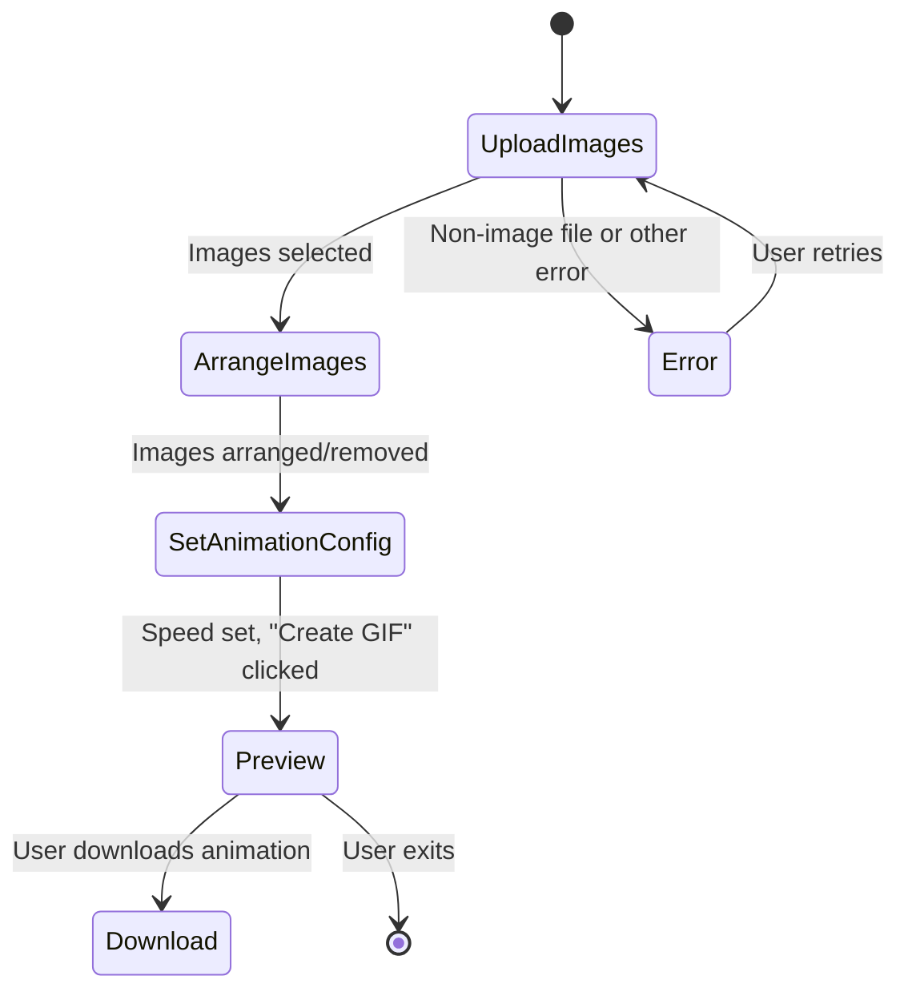

# Architecture Overview: Image to Animation Frontend

## Overview

The **Image Animation Creator** is a single-page React web application that enables users to upload multiple images, arrange their order, select animation speed, and generate a downloadable GIF animation. The application emphasizes simplicity, modern aesthetic, and accessibility, relying only on vanilla React and CSS without any heavy UI framework.

---

## High-Level Architecture

```mermaid
flowchart TD
    A[User Interface<br/>(App component)] --> B(Image Upload)
    A --> C(Arrangement Grid)
    A --> D(Animation Settings)
    A --> E(Preview & Download)
    B -->|accept files| A
    C -->|set order| A
    D -->|select speed| A
    E -->|view, download| A
    A -.-> F[gif.js (external library)]
    F -->|generate GIF| E
```

- **App**: Main React component and entry point.
- **Components**: All UI and business logic are contained in the `App.js` component, including helpers for GIF generation and animation preview.
- **External Library**: `gif.js` is dynamically loaded from CDN when GIF functionality is required.

---

## Component & Data Structure

### Main UI Sections

1. **Image Upload Area**  
   - File input (hidden), accessible via Upload Images button
   - Drag-and-drop dropzone
   - Error display for invalid files

2. **Arrangement Grid**
   - Thumbnails of uploaded images, each draggable for reordering
   - Remove option on each image
   - Visual index for arrangement order

3. **Animation Settings**
   - Speed slider (100–2000ms per frame)
   - "Create GIF" button (disabled unless ≥ 2 images)
   - Error messages for invalid actions

4. **Preview & Download**
   - GIF preview (if generated)
   - Fallback preview animating images as  for immediate feedback
   - Download GIF button after animation is created

5. **Footer**
   - Attribution to gif.js, branding

---

## State & Logic

- **images**: Array of objects `{src, file, name}` representing chosen images.
- **draggedIdx**: Index for image reordering (drag-and-drop logic).
- **animationSpeed**: Current GIF frame update speed.
- **gifUrl**: URL for generated GIF, used for preview/download.
- **error**: User interface error messages (non-image file, too few images, generation failure).
- **isGenerating**: Boolean for showing loading state during GIF generation.

---

## Core Flow Diagram



---

## External Dependencies

- **gif.js**: Dynamically loaded from CDN, responsible for actual GIF encoding and rendering entirely on the client side.

---

## Accessibility & Responsiveness

- Buttons, image thumbnails, dropzones, and other controls use semantic labels (`aria-label`, `role`) for accessibility.
- Layout is responsive via pure CSS to support mobile and desktop users.

---

## Test Architecture

- Located in `src/App.test.js`
- Comprehensive suite covers:
  - File upload (input and drag/drop)
  - Image arrangement and removal
  - GIF generation (mocked for tests)
  - Error and edge cases
  - Download functionality
  - Accessibility and rendering checks

---

## Security Considerations

- Client-side only; no user uploads leave the browser.
- Accepts only image files; provides immediate feedback on invalid input.

---

## Future Extensibility

- Modular design in single file; easily refactorable into multiple components.
- GIF generation logic can be split for support with video exports or different formats.

---

### File Reference

- `src/App.js` — All main app logic and UI.
- `src/App.test.js` — Feature and integration tests.
- `src/App.css` — Component and theme styles.

