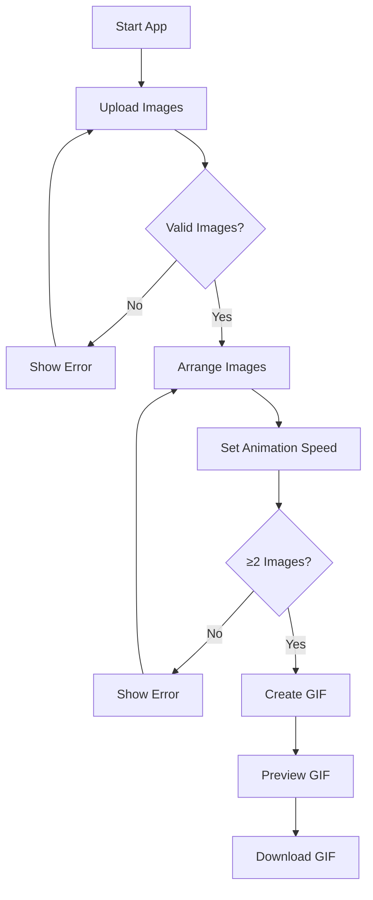

# Product Requirements Document (PRD): Image Animation Creator Frontend

## 1. Purpose

Enable users to rapidly upload multiple images, arrange their order, set animation speed, preview the resulting animation, and download it as a GIF file. Prioritize an intuitive, responsive, and modern experience, requiring no login or backend.

## 2. Target Audience

- Content creators and casual users
- Anyone needing quick image-to-GIF conversion from browser

## 3. Functional Requirements

### 3.1 Image Upload

- Users can upload multiple images simultaneously via file picker or drag-and-drop.
- Only image files (checked by MIME type) are accepted.
- Uploaded images are previewed as thumbnails.
- Informative errors are shown for invalid files.

### 3.2 Image Arrangement

- Uploaded images are displayed in a grid with drag-and-drop to reorder.
- Each thumbnail has a "Remove" button.
- The arrangement determines GIF frame order.

### 3.3 Animation Settings

- Users select animation speed via a slider (100–2000ms per frame).
- "Create GIF" button generates the animation.
- Button is disabled if fewer than 2 images.

### 3.4 Preview and Download

- Displays preview of the animation:
  - If GIF is generated: shows the actual GIF.
  - If not: fallback animation cycles  elements for immediate feedback.
- Allows download of GIF via "Download GIF" button.

### 3.5 Error Handling

- Displays errors for:
  - Non-image uploads
  - GIF generation failure
  - Attempting to generate with <2 images
- All errors are visible in a dedicated area.

---

## 4. Non-functional Requirements

- **Performance**: App loads quickly, works offline after load (PWA-ready).
- **Accessibility**: All controls suitable for keyboard/screen-reader navigation.
- **Responsiveness**: Usable on desktops, tablets, and mobiles via responsive layout.
- **Style**: Minimal, modern, and visually appealing per brand theme.
- **Privacy/Security**: All processing is local; no image or data leaves the user browser.

---

## 5. User Flow Diagram

---

## 6. UI/UX Requirements

- **Upload Area**: Prominent, with clear CTAs and drag/drop support.
- **Arrangement Area**: Easy thumb-move interface with visual order index.
- **Animation Settings**: Obvious slider and "Create GIF" CTA.
- **Preview/Download**: Central area to show animation and download option.
- **Error Display**: Clearly styled and placed near user action context.
- **Theme**: Colors per brand config (primary: #1976D2, secondary: #424242, accent: #FF4081, light background).

---

## 7. Accessibility and Edge Cases

- Each image, button, and control has an `aria-label`.
- Tab and keyboard navigation is fully supported.
- Attempting to upload non-images, remove all images, or generate GIF with too few images all handled gracefully.

---

## 8. Out of Scope

- No user authentication
- No backend upload or server-side processing
- No export formats except GIF
- No external storage or analytics

---

## 9. References

- Main logic: `src/App.js`
- Styling: `src/App.css`
- Testing: `src/App.test.js`
